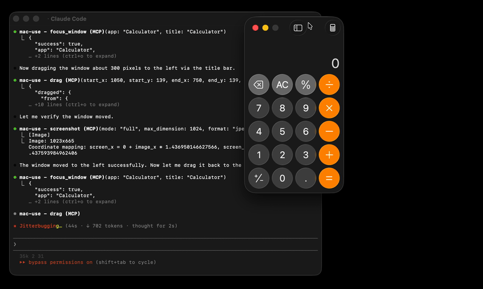

# mac-use-mcp



> [!WARNING]
> **This tool has full control over mouse, keyboard, and screen.** Please use in a sandboxed environment to protect your privacy and avoid accidental data loss by your agents. You are responsible for any actions performed through this tool.

Zero-native-dependency macOS desktop automation via MCP.

Give AI agents eyes and hands on macOS — click, type, screenshot, and inspect any application.

[](https://github.com/antbotlab/mac-use-mcp/actions/workflows/ci.yml)
[](https://www.npmjs.com/package/mac-use-mcp)
[](https://www.npmjs.com/package/mac-use-mcp)
[](./LICENSE)
[](https://www.typescriptlang.org/)


## Use Cases

- **Automated UI testing** — click buttons, verify element states with `get_ui_elements`, validate screen content via `screenshot`
- **Desktop workflow automation** — launch apps with `open_application`, fill forms with `type_text`, navigate menus via `click_menu`
- **Screenshot-based monitoring** — capture screen regions periodically with `screenshot` for visual diffing or alerting
- **Accessibility inspection** — query UI element trees with `get_ui_elements` for QA and compliance checks
- **AI agent computer use** — give LLMs eyes and hands on macOS via `screenshot`, `click`, `type_text`, and more

## Why mac-use-mcp?

- **Just works** — `npx mac-use-mcp` and grant two macOS permissions. No node-gyp, no Xcode tools, no build step.
- **18 tools, one server** — screenshots, clicks, keystrokes, window management, accessibility inspection, and clipboard.
- **macOS 13+ on Intel and Apple Silicon** — no native addons, no architecture headaches.

## Install

**Requirements:** macOS 13+ and Node.js 22+. The server communicates over **stdio** transport.

> This package only works on macOS. It will refuse to install on other operating systems.

No build steps. No native dependencies. Just run:

```bash
npx mac-use-mcp
```

> `npx` will prompt to install the package on first run. Use `npx -y mac-use-mcp` to skip the confirmation.

> [!TIP]
> **Model selection matters.** Desktop automation involves screenshot–action loops that add up in token usage. A fast model with solid reasoning, good vision, and reliable tool calling is recommended:
>
> | Model | Provider |
> |-------|----------|
> | Gemini 3 Flash | Google |
> | Claude Sonnet 4.6 | Anthropic |
> | GPT-5 mini | OpenAI |
> | MiniMax-M2.5 | MiniMax |
> | Kimi K2.5 | Moonshot AI |
> | Qwen3.5 | Alibaba |
> | GLM-4.7 | Zhipu AI |

## Permission Setup

mac-use-mcp requires two macOS permissions to function. Grant them once and you're set.

### Accessibility

Required for mouse and keyboard control.

1. Open **System Settings** > **Privacy & Security** > **Accessibility**
2. Click the **+** button
3. Add your MCP client application (e.g., Claude Desktop, your terminal emulator)
4. Ensure the toggle is enabled

### Screen Recording

Required for screenshots.

1. Open **System Settings** > **Privacy & Security** > **Screen Recording**
2. Click the **+** button
3. Add your MCP client application
4. Ensure the toggle is enabled
5. Restart the application if prompted

### Verify permissions

After granting both permissions and configuring your MCP client (see next section), use the `check_permissions` tool to confirm everything is working:

```
> check_permissions
✓ Accessibility: granted
✓ Screen Recording: granted
```

## MCP Client Configuration

<details open>
<summary><strong>Claude Code</strong></summary>

```bash
claude mcp add mac-use-mcp -- npx mac-use-mcp
```

</details>

<details>
<summary><strong>Claude Desktop</strong></summary>

Add to `~/Library/Application Support/Claude/claude_desktop_config.json`:

```json
{
  "mcpServers": {
    "mac-use-mcp": {
      "command": "npx",
      "args": ["mac-use-mcp"]
    }
  }
}
```

</details>

<details>
<summary><strong>OpenAI Codex</strong></summary>

Add to `~/.codex/config.toml`:

```toml
[mcp_servers.mac-use]
command = "npx"
args = ["-y", "mac-use-mcp"]
```

Or via CLI:

```bash
codex mcp add mac-use -- npx -y mac-use-mcp
```

</details>

<details>
<summary><strong>Google Antigravity</strong></summary>

Add to `~/.gemini/antigravity/mcp_config.json`:

```json
{
  "mcpServers": {
    "mac-use-mcp": {
      "command": "npx",
      "args": ["mac-use-mcp"]
    }
  }
}
```

</details>

<details>
<summary><strong>Gemini CLI</strong></summary>

Add to `~/.gemini/settings.json`:

```json
{
  "mcpServers": {
    "mac-use-mcp": {
      "command": "npx",
      "args": ["mac-use-mcp"]
    }
  }
}
```

</details>

<details>
<summary><strong>VS Code / Copilot</strong></summary>

Add to `.vscode/mcp.json` in your workspace (or open the Command Palette and run **MCP: Open User Configuration** for global setup):

```json
{
  "servers": {
    "mac-use-mcp": {
      "command": "npx",
      "args": ["mac-use-mcp"]
    }
  }
}
```

</details>

<details>
<summary><strong>Cursor</strong></summary>

Add to `~/.cursor/mcp.json` (global) or `.cursor/mcp.json` (project-level):

```json
{
  "mcpServers": {
    "mac-use-mcp": {
      "command": "npx",
      "args": ["mac-use-mcp"]
    }
  }
}
```

</details>

<details>
<summary><strong>Windsurf</strong></summary>

Add to `~/.codeium/windsurf/mcp_config.json`:

```json
{
  "mcpServers": {
    "mac-use-mcp": {
      "command": "npx",
      "args": ["mac-use-mcp"]
    }
  }
}
```

</details>

<details>
<summary><strong>Cline</strong></summary>

Open Cline's MCP settings (in the Cline extension panel, click the MCP servers icon), then add:

```json
{
  "mcpServers": {
    "mac-use-mcp": {
      "command": "npx",
      "args": ["mac-use-mcp"]
    }
  }
}
```

</details>

<details>
<summary><strong>Kiro</strong></summary>

Add to `~/.aws/amazonq/mcp.json`:

```json
{
  "mcpServers": {
    "mac-use-mcp": {
      "command": "npx",
      "args": ["mac-use-mcp"]
    }
  }
}
```

</details>

## Tools

This Node.js MCP server exposes 18 tools for mouse, keyboard, and screen control to any MCP-compatible client.

### Screen

| Tool | Description |
| --- | --- |
| `screenshot` | Capture the screen, a region, or a window by title (PNG or JPEG) |
| `get_screen_info` | Get display count, resolution, origin, and scale factor for each display |

### Input

| Tool | Description |
| --- | --- |
| `click` | Click at screen coordinates with button, click count, and modifier options |
| `move_mouse` | Move the cursor to a position |
| `scroll` | Scroll up, down, left, or right at a position |
| `drag` | Drag from one point to another over a configurable duration |
| `type_text` | Type text at the cursor position (supports Unicode, CJK, and emoji) |
| `press_key` | Press a key or key combination (e.g., `"cmd+c"`, `"Return"`) |

### Window & App

| Tool | Description |
| --- | --- |
| `list_windows` | List all visible windows with positions and sizes |
| `focus_window` | Activate an app and bring a specific window to the front |
| `open_application` | Launch an application by name |
| `click_menu` | Click a menu bar item by path (e.g., "File > Save As...") |

App names support fuzzy matching — `"chrome"` resolves to `"Google Chrome"`, `"code"` to `"Code"`, etc.

### Accessibility

| Tool | Description |
| --- | --- |
| `get_ui_elements` | Query UI elements via Accessibility API — find buttons, text fields, and other controls by role or title |

### Clipboard

| Tool | Description |
| --- | --- |
| `clipboard_read` | Read the current system clipboard as plain text |
| `clipboard_write` | Write text to the system clipboard |

### Utility

| Tool | Description |
| --- | --- |
| `wait` | Pause for a specified duration (in milliseconds, 0–10 000) |
| `check_permissions` | Verify Accessibility and Screen Recording access |
| `get_cursor_position` | Get current cursor coordinates |

## Examples

Common workflow patterns using mac-use-mcp tools:

### Screenshot a specific window

```
1. focus_window({ app: "Safari" })
2. screenshot({ mode: "window", window_title: "Safari" })
```

### Click a button in a dialog

```
1. get_ui_elements({ app: "Finder", role: "AXButton" })
   → finds "OK" button at position (500, 300)
2. click({ x: 500, y: 300 })
```

### Automate a menu action

```
1. open_application({ name: "TextEdit" })
2. click_menu({ app: "TextEdit", path: "Format > Make Plain Text" })
```

### Copy text between apps

```
1. focus_window({ app: "Safari" })
2. press_key({ key: "cmd+a" })       # select all
3. press_key({ key: "cmd+c" })       # copy
4. focus_window({ app: "Notes" })
5. press_key({ key: "cmd+v" })       # paste
```

## How It Works

- **Swift binary** handles mouse input (CGEvent), screen capture (CGWindowListCreateImage), window enumeration (CGWindowListCopyWindowInfo), and UI element queries (Accessibility API)
- **AppleScript** handles keyboard input (System Events `key code`), window focus, and menu clicks
- **Node.js MCP server** orchestrates everything over stdio, translating MCP tool calls into system operations
- **No native Node.js addons** — the Swift binary is pre-compiled and ships with the npm package
- **Serial execution queue** prevents race conditions between system operations

## Known Limitations

- **Screen Recording prompt on Sequoia**: macOS 15 shows a monthly system prompt asking to reconfirm Screen Recording access. This is an OS-level behavior and cannot be suppressed.
- **Secure input fields**: Password fields and other secure text inputs block synthetic keyboard events. This is a macOS security feature.
- **Keyboard input on macOS 26+**: CGEvent keyboard synthesis is silently blocked. Keyboard input uses AppleScript (`System Events key code`) as a workaround, which may behave differently in some edge cases.
- **System dialogs**: Some system-level dialogs (e.g., FileVault unlock, Login Window) cannot be interacted with programmatically due to macOS security restrictions.
- **Headless / CI**: Requires a graphical session. Headless macOS environments (e.g., standard GitHub Actions runners) are not supported.

## Troubleshooting

<details>
<summary><strong>Permission prompts keep appearing</strong></summary>

Grant Accessibility and Screen Recording permissions to your terminal app in System Settings > Privacy & Security. A restart of the terminal may be required.

</details>

<details>
<summary><strong>macOS Sequoia permission dialogs</strong></summary>

macOS 15 (Sequoia) introduced stricter permission prompts. Allow the prompts when they appear. The `check_permissions` tool can verify your current permission status.

</details>

<details>
<summary><strong>Secure input fields</strong></summary>

Some password fields and secure text inputs block programmatic key events. This is a macOS security feature. Use `clipboard_write` + `press_key("cmd+v")` as a workaround.

</details>

<details>
<summary><strong>Screen recording shows black screenshots</strong></summary>

Ensure Screen Recording permission is granted to your terminal app (not just Accessibility). Restart the terminal after granting.

</details>

## Related Projects

- [Playwright MCP](https://github.com/microsoft/playwright-mcp) — Browser automation via accessibility tree. Complements mac-use-mcp for web-only tasks.
- [Peekaboo](https://github.com/steipete/Peekaboo) — macOS screen automation with ScreenCaptureKit. Requires macOS 15+ and a Swift build.
- [awesome-mcp-servers](https://github.com/punkpeye/awesome-mcp-servers) — Curated list of MCP servers across the ecosystem.

## Contributing

See [CONTRIBUTING.md](CONTRIBUTING.md) for development setup and guidelines.

[Changelog](CHANGELOG.md)

## Security

To report a vulnerability, see [SECURITY.md](SECURITY.md).

## Support

- Found a bug? [Open an issue](https://github.com/antbotlab/mac-use-mcp/issues)
- Have a feature idea? [Open an issue](https://github.com/antbotlab/mac-use-mcp/issues)
- Like the project? Give it a star — it helps others discover mac-use-mcp.

## License

[MIT](./LICENSE) &copy; 2026 antbotlab

---

macOS is a trademark of Apple Inc., registered in the U.S. and other countries and regions.
